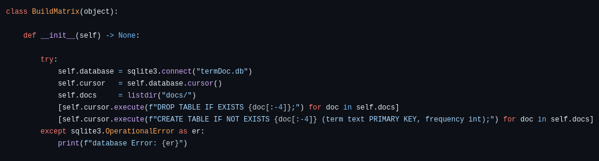
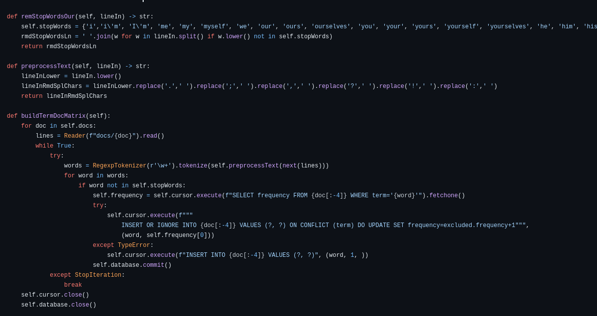
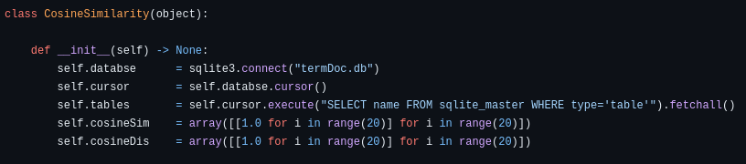
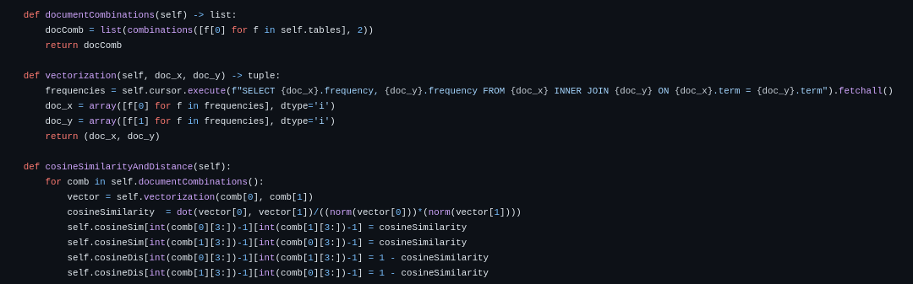
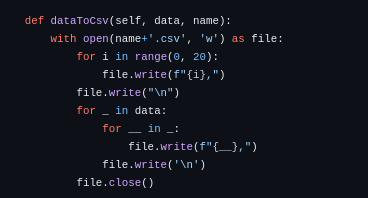
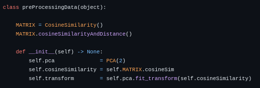
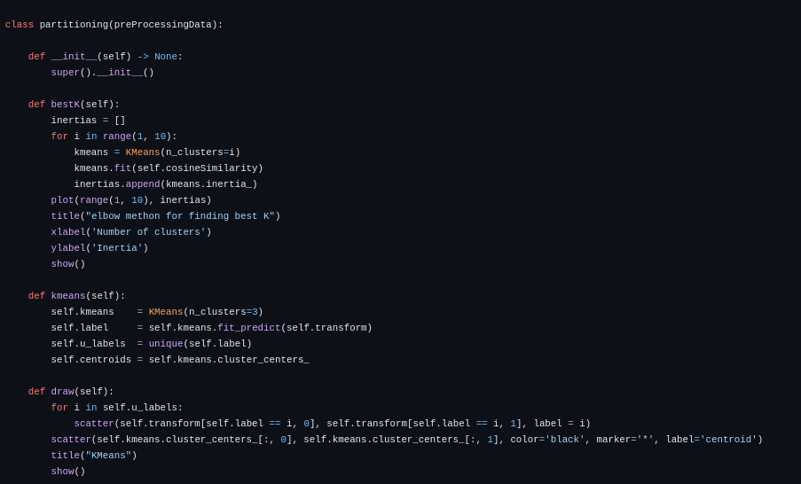
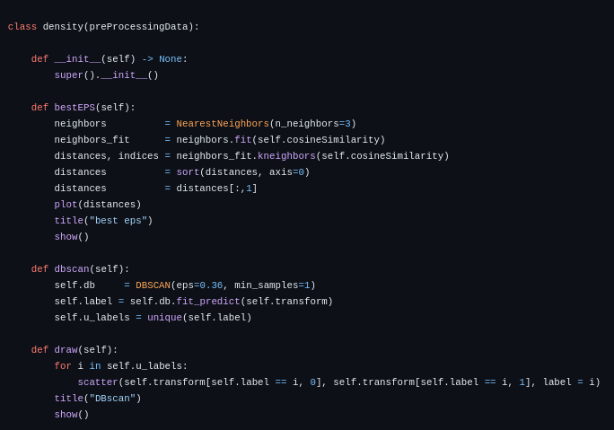

# dmp
## how to run it?
* starting point is `lib/buildMatrix.py` and then after/while building your termDoc matrix you can run `main.py`.

##  how it works?
* As first thing we must do is to calculate the term doument matrix for our  dataset which done by [`buildMatrix.py and fileReader.py`](lib/) , The file reader module read files in memory friendly way. The second step is calculation of similarity beweent docs (consine similarity) which done by [`cosineSimilarity.py`](src/cosineSimilarity)

## Bulding the matrix with [buildMatrix.py](lib/buildMatrix.py)
* As we said we are storing our data on dbms so we need an architecture to satisfy the problem in this step. <hr>
##### db schema
 <hr>

* For each doument we create a table which named as document. (how?)
    * as our document is static we look for our docs in [docs/](docs/) which listed by listdir() >> it may be better if we do some walking on directories for our docs, but we keep it simpler.
    * the db's tables features contains one constraint(which is primary key and choosed from terms) and a frequency(int).
    <hr>
##### text preprocessing
 <hr>
* The buildMatrix() starts completing the termDoc matrix via getting each line of file and pass it to preprocessor and get the normal form of term in each line, to merge it into db.
    * the remStopWordOur(lineIn) && preprocessText(lineIn) preprocessors of lines. (is straigh enough to not discuss it)

## Calculation of CosineSimilarity with [cosineSimilrity.py](src/cosineSimilarity.py)
* The first thing to calculate cosine similarity is building a storage space to store it, we choose a 2D [20*20] array of integer (because of its static type the storage that it occupies decrease).

     <hr>

* now it's time to read vectors from db and find the cosineSimilarity between vectors, but before jumping to get vectors you need a combination of vectors that you want. (how?)
    
     <hr>

    * as we see above the cosineSimilarityAndDistance() at first step calls the documentCombinations() to find the docs combinations and after that gets the pure vector of each doc in a way that we pass all sparse values away (more performance) and don't calculate them in our program, but there is one missing part and that is vectorization() the vectorization just execute the core query for finding the sparse less values between two vectors which comes from combination() after all again we get back to documentCombinations() to store the amounts. <hr>

    

    * In cosineSimilarity as a feature you can get the distance/similarity in csv. [just call it and pass the data you want to csv and then the name of file you want to store csv in it] <hr>

## Clustering from similarity matrix [clustering.py](src/clustering.py)
* In first step we need to call the matrix from cosineSimilarity.py which is the core data in this place, then as you must to know we need decomposition, but why?
    1. The first reason is for normalizing the data in a way that you can draw any graph, you will see at the end you observe the algorithm with a 2D graph so from now you must handle your data.
    2. As you see the [docs/](docs/) there is 20 docs so the matrix has 20*20 values which are mostly repeatedly (just 190 elements are unique) so you need to normalize it.
* As you can see below theses steps for each algorithm must done so we implement a base class and inherit from as we need.

     <hr>

#### KMeans clustering (base on partitioning)
* In first step to run KMeans is to find the best K value, which in there done by bestk(). (also known as elbow method)
    
* In second step we process kmeans on our data with best k values, then passing the transformed (docomposited data with PCA) data to kmeans to get labels. after we go for unique lables because we don't wanna have repeated data in this steps (because it does't make any sense that two element of our data are same and we can't even figure it out while drawing graph because of over-writing), and at the end get the graph of our kmeans result to see what heppened in there. <hr>

#### Agglomerative clustering (base on hierarchical)
* As we discussed for KMeans again we need some preprocessing, The first thing we want pass the argument to process agglomerative on decomposited data.


* The difficulty in there is how to draw the dendogram?
    1. The first thing we must to do is finding the children and where the break points are.
    2. In second step we build a new matrix for linkage between nodes.

#### Dbscan clustering (base on density)
* Again we have some preprocessing in there, but the most important one is to calculate best(not always) eps for our algorithm in there which done by NearestNeighbors from sklearn.neighbors.



## Benefits of our implementation
 
    ```
    1. parallel processing without any multithreading/parallelism with libraries (think you are working on dynamic datas and suddenly you get a requst to calculate)
    
    2. incremental working (in each state you can check your docs clusterig result while 
    other docs are merging to db)
    
    3. performance (this method is ram/cpu friendly, but lazy depending on your storing hardware)
    4. accuracy (nothing miss or crash)
    ```
